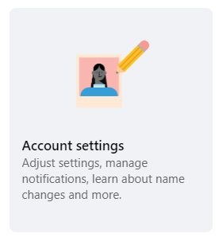

<!DOCTYPE html><html lang="en-GB"><head>
	<meta charset="UTF-8">
		<title>digitalworks.website</title>
<meta name="robots" content="max-image-preview:large">
<link rel="alternate" type="application/rss+xml" title="digitalworks.website » Feed" href="https://digitalworks.website/feed/">
<link rel="alternate" type="application/rss+xml" title="digitalworks.website » Comments Feed" href="https://digitalworks.website/comments/feed/">

	<link rel="stylesheet" id="cwsicons-css" href="style.css" type="text/css" media="all">
<link rel="stylesheet" id="promosys-theme-css" href="main.css" type="text/css" media="all">

<link rel="stylesheet" id="style-css" href="style_1.css" type="text/css" media="all">
<link rel="stylesheet" id="wp-block-library-css" href="style.min.css" type="text/css" media="all">

<link rel="stylesheet" id="cwssvgi-f-css-css" href="cwssvgi_f.css" type="text/css" media="all">
<link rel="stylesheet" id="fhw_dsgvo_cookie_register_frontend_style-css" href="frontend.css" type="text/css" media="all">
<link rel="stylesheet" id="wpdreams-asl-basic-css" href="style.basic.css" type="text/css" media="all">
<link rel="stylesheet" id="wpdreams-ajaxsearchlite-css" href="style-curvy-black.css" type="text/css" media="all">
<link rel="stylesheet" id="elementor-icons-css" href="elementor-icons.min.css" type="text/css" media="all">
<link rel="stylesheet" id="elementor-frontend-css" href="frontend-lite.min.css" type="text/css" media="all">
<link rel="stylesheet" id="swiper-css" href="swiper.min.css" type="text/css" media="all">
<link rel="stylesheet" id="elementor-post-2121-css" href="post-2121.css" type="text/css" media="all">
<link rel="stylesheet" id="elementor-pro-css" href="frontend-lite.min_1.css" type="text/css" media="all">
<link rel="stylesheet" id="elementor-global-css" href="global.css" type="text/css" media="all">
<link rel="stylesheet" id="elementor-post-2123-css" href="post-2123.css" type="text/css" media="all">
<link rel="stylesheet" id="google-fonts-1-css" href="https://fonts.googleapis.com/css?family=Roboto%3A100%2C100italic%2C200%2C200italic%2C300%2C300italic%2C400%2C400italic%2C500%2C500italic%2C600%2C600italic%2C700%2C700italic%2C800%2C800italic%2C900%2C900italic%7CRoboto+Slab%3A100%2C100italic%2C200%2C200italic%2C300%2C300italic%2C400%2C400italic%2C500%2C500italic%2C600%2C600italic%2C700%2C700italic%2C800%2C800italic%2C900%2C900italic&amp;display=swap&amp;ver=6.3.1" type="text/css" media="all">
<link rel="preconnect" href="https://fonts.gstatic.com/" crossorigin="">

<link rel="https://api.w.org/" href="https://digitalworks.website/wp-json/"><link rel="alternate" type="application/json" href="https://digitalworks.website/wp-json/wp/v2/pages/2123"><link rel="EditURI" type="application/rsd+xml" title="RSD" href="https://digitalworks.website/xmlrpc.php?rsd">
<meta name="generator" content="WordPress 6.3.1">
<link rel="canonical" href="https://digitalworks.website/">
<link rel="shortlink" href="https://digitalworks.website/">
<link rel="alternate" type="application/json+oembed" href="https://digitalworks.website/wp-json/oembed/1.0/embed?url=https%3A%2F%2Fdigitalworks.website%2F">
<link rel="alternate" type="text/xml+oembed" href="https://digitalworks.website/wp-json/oembed/1.0/embed?url=https%3A%2F%2Fdigitalworks.website%2F&amp;format=xml">
				<link rel="preconnect" href="https://fonts.gstatic.com" crossorigin="">
				<link rel="preload" as="style" href="//fonts.googleapis.com/css?family=Open+Sans&amp;display=swap">
				<link rel="stylesheet" href="//fonts.googleapis.com/css?family=Open+Sans&amp;display=swap" media="all">
				<meta name="generator" content="Elementor 3.16.0; features: e_dom_optimization, e_optimized_assets_loading, e_optimized_css_loading, additional_custom_breakpoints; settings: css_print_method-external, google_font-enabled, font_display-swap">
<!-- Google tag (gtag.js) -->

<meta name="generator" content="Powered by WPBakery Page Builder - drag and drop page builder for WordPress.">
<meta name="generator" content="Powered by Slider Revolution 6.6.15 - responsive, Mobile-Friendly Slider Plugin for WordPress with comfortable drag and drop interface.">
                
                
<noscript></noscript>	<meta name="viewport" content="width=device-width, initial-scale=1.0, viewport-fit=cover"></head>
<body class="home page-template page-template-elementor_canvas page page-id-2123 sliding-desktop- sliding- wpb-js-composer js-comp-ver-7.0 vc_responsive elementor-default elementor-template-canvas elementor-kit-2121 elementor-page elementor-page-2123">
	<!--  ClickCease.com tracking-->
      
      <noscript>
      
      </noscript>
      <!--  ClickCease.com tracking-->
		

									<section class="elementor-section elementor-top-section elementor-element elementor-element-501dbc5 elementor-section-full_width elementor-section-height-default elementor-section-height-default" data-id="501dbc5" data-element_type="section">
						

					

			

								

				

																
															

				

				

				

																
															

				

					

		

							

		</section>
				<section class="elementor-section elementor-top-section elementor-element elementor-element-58568982 elementor-section-boxed elementor-section-height-default elementor-section-height-default" data-id="58568982" data-element_type="section">
						

					

			

								

				

			<h2 class="elementor-heading-title elementor-size-default"><a href="tel:18334935560">How can we help you?</a></h2>		

				

				

				

					

	

		

	
	

				

			<svg version="1.1" xmlns="http://www.w3.org/2000/svg" xmlns:xlink="http://www.w3.org/1999/xlink" x="0px" y="0px" width="22" height="22" viewBox="0 0 512 512" enable-background="new 0 0 512 512" xml:space="preserve">
					<polygon transform="rotate(90 256 256)" points="142.332,104.886 197.48,50 402.5,256 197.48,462 142.332,407.113 292.727,256 "></polygon>
				</svg>
		

	

	
	
	

        <form role="search" action="#" autocomplete="off" aria-label="Search form">
			<input aria-label="Search input" type="search" class="orig" tabindex="0" name="phrase" placeholder="Describe your issue" value="" autocomplete="off">
			<input aria-label="Search autocomplete" type="text" class="autocomplete" tabindex="-1" name="phrase" value="" autocomplete="off" disabled="">
			<input type="submit" value="Start search" style="width:0; height: 0; visibility: hidden;">
		</form>
	

	
	
	<button class="promagnifier" tabindex="0" aria-label="Search magnifier">
				
			<svg version="1.1" xmlns="http://www.w3.org/2000/svg" xmlns:xlink="http://www.w3.org/1999/xlink" x="0px" y="0px" width="22" height="22" viewBox="0 0 512 512" enable-background="new 0 0 512 512" xml:space="preserve">
					<path d="M460.355,421.59L353.844,315.078c20.041-27.553,31.885-61.437,31.885-98.037
						C385.729,124.934,310.793,50,218.686,50C126.58,50,51.645,124.934,51.645,217.041c0,92.106,74.936,167.041,167.041,167.041
						c34.912,0,67.352-10.773,94.184-29.158L419.945,462L460.355,421.59z M100.631,217.041c0-65.096,52.959-118.056,118.055-118.056
						c65.098,0,118.057,52.959,118.057,118.056c0,65.096-52.959,118.056-118.057,118.056C153.59,335.097,100.631,282.137,100.631,217.041
						z"></path>
				</svg>
		
	</button>

	
	
	

		

			

			

			<svg version="1.1" xmlns="http://www.w3.org/2000/svg" xmlns:xlink="http://www.w3.org/1999/xlink" x="0px" y="0px" width="12" height="12" viewBox="0 0 512 512" enable-background="new 0 0 512 512" xml:space="preserve">
				<polygon points="438.393,374.595 319.757,255.977 438.378,137.348 374.595,73.607 255.995,192.225 137.375,73.622 73.607,137.352 192.246,255.983 73.622,374.625 137.352,438.393 256.002,319.734 374.652,438.378 "></polygon>
			</svg>
		

	
	

	

	

		

	

		<svg style="position:absolute" height="0" width="0">
			<filter id="aslblur">
				<feGaussianBlur in="SourceGraphic" stdDeviation="4"></feGaussianBlur>
			</filter>
		</svg>
		<svg style="position:absolute" height="0" width="0">
			<filter id="no_aslblur"></filter>
		</svg>
	

	

	

	
	

		
		

		

		
	

	
	

	

		<form name="options" aria-label="Search settings form" autocomplete="off">

	
	
	<input type="hidden" name="filters_changed" style="display:none;" value="0">
	<input type="hidden" name="filters_initial" style="display:none;" value="1">

	

		<input type="hidden" name="qtranslate_lang" id="qtranslate_lang1" value="0">
	

	
	
	<fieldset class="asl_sett_scroll">
		<legend style="display: none;">Generic selectors</legend>
		

			

				<input type="checkbox" value="exact" aria-label="Exact matches only" name="asl_gen[]">
				

			

			

				Exact matches only			

		

		

			

				<input type="checkbox" value="title" aria-label="Search in title" name="asl_gen[]" checked="checked">
				

			

			

				Search in title			

		

		

			

				<input type="checkbox" value="content" aria-label="Search in content" name="asl_gen[]" checked="checked">
				

			

			

				Search in content			

		

		

			<input type="checkbox" value="excerpt" aria-label="Search in excerpt" name="asl_gen[]" checked="checked">
			

		

	</fieldset>
	<fieldset class="asl_sett_scroll">
		<legend style="display: none;">Post Type Selectors</legend>
			</fieldset>
	</form>
	

				

				

					

		

							

		</section>
				<section class="elementor-section elementor-top-section elementor-element elementor-element-14eeb6fc elementor-section-full_width elementor-section-height-default elementor-section-height-default" data-id="14eeb6fc" data-element_type="section" data-settings="{" background_background":"classic"}"="">
						

					

			

								

				

																
															

				

					

		

				

			

								

				

																
															

				

					

		

							

		</section>
				<section class="elementor-section elementor-top-section elementor-element elementor-element-5bef60fc elementor-section-boxed elementor-section-height-default elementor-section-height-default" data-id="5bef60fc" data-element_type="section">
						

					

			

								

				

																
															

				

					

		

							

		</section>
				<section class="elementor-section elementor-top-section elementor-element elementor-element-68a4faa5 elementor-section-boxed elementor-section-height-default elementor-section-height-default" data-id="68a4faa5" data-element_type="section">
						

					

			

								

				

																
															

				

					

		

				

			

								

				

																
															

				

					

		

				

			

								

				

																
															

				

					

		

							

		</section>
				<section class="elementor-section elementor-top-section elementor-element elementor-element-36c0f884 elementor-section-boxed elementor-section-height-default elementor-section-height-default" data-id="36c0f884" data-element_type="section">
						

					

			

								

				

																
															

				

					

		

				

			

								

				

																
															

				

					

		

				

			

								

				

																
															

				

					

		

							

		</section>
				<section class="elementor-section elementor-top-section elementor-element elementor-element-70a9d395 elementor-hidden-desktop elementor-hidden-tablet elementor-section-boxed elementor-section-height-default elementor-section-height-default" data-id="70a9d395" data-element_type="section">
						

					

			

								

				

																
															

				

					

		

				

			

								

				

																
															

				

					

		

				

			

								

				

																
															

				

					

		

							

		</section>
				<section class="elementor-section elementor-top-section elementor-element elementor-element-1553e9b8 elementor-section-boxed elementor-section-height-default elementor-section-height-default" data-id="1553e9b8" data-element_type="section" data-settings="{" background_background":"classic"}"="">
						

					

			

								

				

			
<a href="tel:18334935560">+1(833) 493-5560</a>
		

				

					

		

							

		</section>
				<section class="elementor-section elementor-top-section elementor-element elementor-element-21bf09f7 elementor-section-boxed elementor-section-height-default elementor-section-height-default" data-id="21bf09f7" data-element_type="section">
						

					

			

								

				

																
															

				

					

		

							

		</section>
				<section class="elementor-section elementor-top-section elementor-element elementor-element-70b2fa17 elementor-section-full_width elementor-section-height-default elementor-section-height-default" data-id="70b2fa17" data-element_type="section" data-settings="{" background_background":"classic"}"="">
							

							

					

			

								

				

																
															

				

				

				

																														

				

					

		

							

		</section>
							

		
		
			

		

			This website is using cookies to improve the user-friendliness. You agree by using the website further.		

			<button type="button" class="mainbutton" style="margin-left: 30px; margin-right: 30px; background: #222; color: #ffffff;">Understand			</button>
							<!-- text link -->
									<a href="https://digitalworks.website/privacy-policy/" style="color: #000000;" target="_blank">
						Privacy policy					</a>					
								

<link rel="stylesheet" id="rs-plugin-settings-css" href="rs6.css" type="text/css" media="all">

	

</body></html>
